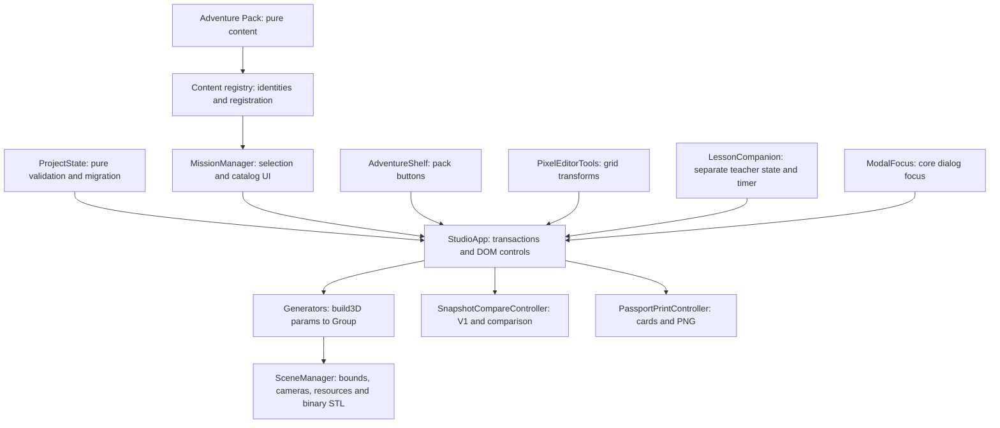

# Architecture audit — 2026-10-07

## Baseline and authority

Inspected clean `main` at `1f0fc11` (app `1.8.1`), origin
`https://github.com/Figarist/3d-club-studio.git`. The owner invoked
`ARCHITECTURE_AUDIT_PROMPT.md`, including bounded delegation, implementation,
separate commits and pushes. Three read-only investigations used `gpt-6-luna`
with xhigh reasoning. Integration and browser verification belong to the main worker.
No package installation, runtime dependency, Boolean engine or framework migration.

This report supersedes suspected architecture problems in the execution prompt;
the prompt itself is a historical task specification, not evidence of a defect.

## Ownership and dependency direction

Scripts remain ordinary local IIFEs. Base missions register after ContentRegistry;
Minecraft presets exist before the Adventure Pack registers. UI extensions mount
after content; SceneManager loads before `app.js`, which remains last.
Pure content registration and project validation run without `document` or THREE.

StudioApp owns the project transaction, undo, autosave, import and controls.
Minecraft additionally owns its editable grid and palette. The three other
generators consume controls as parameters; they do not own serialized project
state. SceneManager owns returned groups and effects after handoff. LessonCompanion
owns a separate teacher storage key; project imports do not replace its challenges
or timer. V1 is a retained historical image/metrics record, not evidence that the
current geometry was sliced or physically printed.

## Findings and selected repair order

All source findings below are **Repository-verified**. Browser reproduction and
deterministic checks are distinguished in the verification section.

| Priority | Baseline trigger and evidence | Selected repair |
|---|---|---|
| P1 | `app.js:475–490` checks only app ID; `minecraftForge.js:432–448` can throw on a malformed row after earlier state writes | Pure preflight schema validation, legacy migration, apply clears/defaults, failure before history/live mutation; restoration guard uses finally |
| P1 | `adventurePack.js:501–549` allocates IDs from max existing ID and pushes one mission at a time; presets were already mutated at 362–379 | Fixed IDs 13–24 and stable keys, indexes, staged atomic registration; unknown references fail explicitly |
| P1 | `app.js:743–748` changes mission/checks before undo snapshot | Record the complete old project before mission mutation; suppress interim autosave; restore identity and UI together |
| P2 | `app.js:496–503` invalidates status but retains slicer note | Clear both together on geometry changes |
| P2 | `app.js:306–314` ignores null V1/empty pair values | Explicit normalized clear paths and snapshot-label timer cancellation |
| P2 | `snapshotCompareController.js:38–54,78–86,138–151` fabricates duration when no numeric slicer input exists | Preserve literal records; remove guessed durations and inferred print readiness |
| P2 | Physics module Map retains disposed BoxGeometry until another physics build | Limit cache lifetime to the construction/demo operation; group/effects retain their own references |
| P2 | `app.js:853–863` handles project shortcuts while text controls are editing | Editable-focus guard; preserve native text undo |
| P2 | Core dialogs have close controls but no focus ownership; LessonCompanion already has its own trap/restore | Small listener-free ModalFocus helper for core dialogs; preserve teacher implementation |
| P3 | AGENTS §3.3 claims all generators serialize themselves, but only Minecraft implements it | Correct contract documentation rather than add meaningless stubs |

Identity comes first so state validation can resolve references unambiguously.
Validation then makes undo/import repairs safe. Print evidence and cache ownership
are independent units. Documentation follows the final integrated implementation.

## State compatibility and identity

New files use `schemaVersion: 1`; `version` describes the app release only.
Missing schemaVersion identifies legacy schema 1. Unknown schema versions,
invalid grids, non-finite values, invalid enums and missing mission references
must fail before applying the candidate. Legacy IDs remain supported; a supplied
stable key takes precedence and an unknown key must not fall back to a numeric ID.
The normalization contract and regression fixtures are documented in EXTENSIONS.

## Catalog growth and isolation

Identity lookups use maps; registration checks duplicates/references before
publishing. Navigation and catalog filtering still iterate the ordered catalog.
Catalog markup is rebuilt on opening/filtering/selection, and AdventureShelf
still renders one supplied pack at startup. With 24 missions this audit has no
measured performance evidence that warrants pagination, virtual rendering or
a generic generator framework. No numeric capacity promise is made.

Adding a pack is a registration/content change plus a local script tag; exposing
an additional shelf requires a small explicit app mount. Adding a generator
still requires constructor, tab/panel controls, parameter mapping, state schema,
mission configuration support and docs. This is explicit integration work, not
automatic plug-in discovery. See EXTENSIONS for the exact recipe.

## Resource and export boundaries

SceneManager deduplicates disposal of geometries/materials when replacing groups
and effects, retaining the scene-owned monochrome material. Generator-local
material/geometry references belong to each returned group. The Physics cache is
construction-scoped after this repair. Object URLs for JSON/STL downloads are
revoked; snapshots use PNG data URLs. LessonCompanion has timer/listener teardown;
PixelEditorTools and AdventureShelf replace mount children.

SceneManager and StudioApp remain one-page, one-init owners. Anonymous resize,
pointer and keyboard listeners and the renderer RAF lack a complete application
destroy/remount API. This is a future lifecycle limitation, **not an observed
growing memory leak**. A full teardown requires an explicit future embedding
contract and isolated lifecycle verification.

One Three.js unit remains one millimeter. Bounds/bed checks use settled geometry;
binary STL walks transformed triangles. Adjacent voxel groups, overlapping meshes
and a flat bottom do not prove a manifold printable union. There is no Boolean
union engine in this audit. Slicer repair, real print duration/material consumption,
durability, printer throughput and physical print acceptance remain **Not verified**.

## Verification

Completed source changes: stable atomic registry (`0158f38`), validated state and
transactions (`d23b33a`), literal print records and resource ownership (`5d97375`).
These commits were pushed successfully after two transient GitHub server errors.
Final release metadata is `1.8.2`; schema remains 1.

| Evidence | Focused result |
|---|---|
| Repository-verified | Changed JavaScript parses; relative local assets exist; dependency order/app-last and all five release-version locations agree; diff whitespace and changed documentation links checked |
| Deterministic source execution | `verify-content-registry.cjs`: tiny pack order, numeric/stable resolution, invalid-pack atomicity and real 24-mission registration PASS |
| Deterministic source execution | `verify-project-state.cjs`: 15 cases, legacy fixture, invalid values, unknown schema/key, detached grid, colors and normalization roundtrip PASS |
| Deterministic source execution | `verify-history-transactions.cjs`: 2 focused cases, timestamp-independent dedup and undo/redo PASS |
| Deterministic resource execution | `verify-physics-geometry-cache.cjs`: one build/demo/use/dispose/rebuild scenario with bundled THREE and actual SceneManager cleanup PASS; no heap measurement |
| Runtime-verified, local HTTP | Actual shelf button → model/mission → Undo/Redo restores mission, grid and shelf; transform → Undo restores grid and old verification/note; geometry change clears status/note |
| Runtime-verified, local HTTP | Real file chooser imports legacy JSON; malformed grid/future schema show error with model/history intact; explicit null V1/empty pair clears prior state; transformed edit survives reload |
| Runtime-verified, local HTTP | Native text undo does not pop project history; Physics → Minecraft → Physics works; non-Minecraft passport connectivity is explicitly unverified |
| Runtime-verified, local HTTP | Core modal focus enters/traps/returns; 1366×768 passport and 1024×768 mission dialog fit, close is reachable and catalog scrolls; snapshot slicer `<b>TEST 14 хв</b>` stays literal text (zero child markup), no invented time delta |
| INDETERMINATE | Actual save button clicked, but the embedded browser download event timed out after 10 seconds. No captured file/download roundtrip claim; inspect manually in a browser with download support |
| Not verified | Direct-file launch, physical print/slicer acceptance, full app destroy/remount, production deployment and numerical catalog capacity |

Each deterministic batch is below 20 discovered cases and completed below the
60-second budget. Browser work used small explicit batches, synthetic fixtures
and a fresh isolated localhost origin. The timed-out download wait was stopped;
there was no repeated polling or alternate full-suite runner. No full suite,
large-catalog simulation, timer soak or one-hour classroom session was run.

Direct `file://` browser navigation was rejected by the browser tool's URL policy;
no workaround was attempted. Local HTTP is the permitted launch verification.
An initial browser origin served cached older presentation; final evidence uses
a fresh localhost origin and current source. That initial duration badge is not
treated as a defect in current SceneManager source.

## Remaining limits

- Dynamic pack unload and repeated whole-app mount/destroy are not implemented.
- Catalog UI still rebuilds the bounded current catalog; scaling costs unmeasured.
- Generator/UI adapters remain explicit in StudioApp; no speculative abstraction.
- Direct-file, physical printer and deployed-site acceptance are separate checks.
- File download remains INDETERMINATE in the embedded browser; file import and
  autosave reload were exercised, but exported-file readback was not established.
